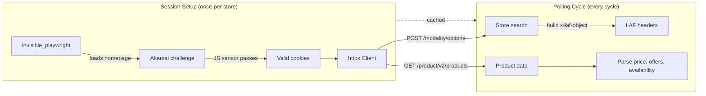
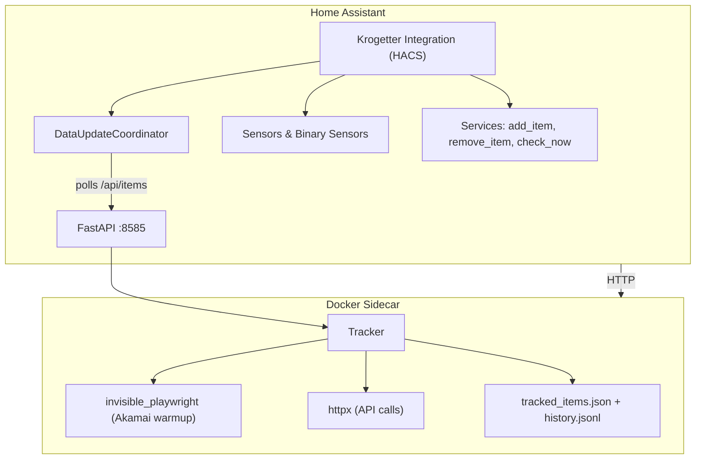
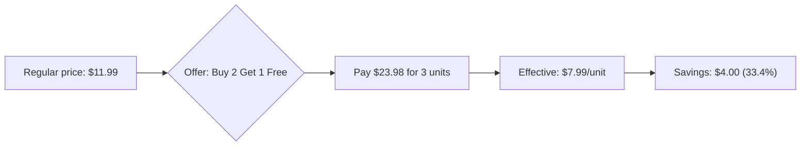

# Krogetter

Track sale prices and offers on Kroger family store websites (King Soopers, Kroger, Fred Meyer, Smith's, Ralphs, etc.). Get notified when items go on sale — including "Buy 2 Get 1 Free" style offers that the official Kroger API doesn't expose.

## How It Works

Krogetter uses [invisible_playwright](https://github.com/feder-cr/invisible_playwright) (a stealth Firefox build with C++-patched fingerprinting) to pass Akamai bot detection, then calls the Kroger product v2 API (`/atlas/v1/product/v2/products`) via native `httpx` for all data. No API keys, no OAuth, no login required.

The browser is used **only** for the initial Akamai warmup (one homepage load). After extracting cookies and user-agent, all API calls — store search, product fetches, price checks — are plain HTTP. Sessions are cached across polling cycles, so subsequent checks make zero browser calls.



### Store Selection

Store selection uses the Kroger modality API:
- `POST /atlas/v1/modality/options` — search stores by ZIP code
- Build `x-laf-object` header from the response (Location And Fulfillment)
- Pass to product API for store-specific pricing

No `PUT /modality/preferences` is needed — the `x-laf-object` header is all the product API requires.

When no ZIP code is provided, the IP-geolocated default store is used automatically (via `POST /atlas/v1/modality/preferences`).

## Architecture

The stealth Firefox binary requires GTK/NSS system libraries that cannot run inside Home Assistant's Alpine-based container. Krogetter solves this with a two-part architecture:



## Quick Start (Home Assistant)

### 1. Run the API server

The API server runs the stealth Firefox browser and exposes a REST API. Run it as a Docker container alongside Home Assistant:

```yaml
# Add to your docker-compose.yml, or create a separate one
services:
  krogetter:
    image: ghcr.io/ahornerr/krogetter:latest
    container_name: krogetter
    restart: unless-stopped
    ports:
      - "8585:8585"
    volumes:
      - ./krogetter-data:/data
    environment:
      KROGETTER_DATA_DIR: /data
      KROGETTER_POLL_INTERVAL: "3600"
      KROGETTER_LOG_LEVEL: INFO
```

```bash
docker compose up -d
```

If HA and Krogetter are on the same Docker network, the API URL is `http://krogetter:8585`. If using host networking or separate hosts, use `http://<host>:8585`.

### 2. Install the HA integration via HACS

1. In HACS → Add Repository → search for `ahornerr/krogetter`
2. Install the "Krogetter" integration
3. Restart Home Assistant
4. Settings → Devices & Services → Add Integration → search "Krogetter"
5. Enter the API server URL (e.g. `http://krogetter:8585` or `http://localhost:8585`)

### 3. Add items to track

Via the integration's Configure button, or use the `krogetter.add_item` service:

```yaml
# Basic — auto-derives label from URL, uses IP-geolocated default store
service: krogetter.add_item
data:
  url: "https://www.kingsoopers.com/p/coca-cola-vanilla-zero-sugar/0004900004825"

# With store selection
service: krogetter.add_item
data:
  url: "https://www.kingsoopers.com/p/.../0004900004825"
  label: "Coke Vanilla"
  zip_code: "80207"
  delivery: false
  store_id: "62000093"
```

Or use the CLI on the API server container:

```bash
docker exec -it krogetter krogetter add "https://www.kingsoopers.com/p/.../0004900004825" --zip 80207
```

### 4. Check prices

The API server polls automatically (default every hour). To trigger an immediate check:

```yaml
# Check all items
service: krogetter.check_now

# Check a specific item
service: krogetter.check_now
data:
  upc: "0004900004825"
```

## CLI Usage

Krogetter also works as a standalone CLI tool (no HA required):

```bash
# Clone and install
git clone git@github.com:ahornerr/krogetter.git
cd krogetter
python -m venv .venv
source .venv/bin/activate
pip install -e ".[dev]"

# Download invisible_playwright Firefox binary (one-time, ~100MB)
python -m invisible_playwright fetch
```

### Commands

```bash
# Add a product to track
krogetter add "https://www.kingsoopers.com/p/.../0004900004825"
krogetter add "https://www.kingsoopers.com/p/.../0004900004825" --label "Coke Vanilla"
krogetter add "https://www.kingsoopers.com/p/.../0004900004825" --zip 80207
krogetter add "https://www.kingsoopers.com/p/.../0004900004825" --zip 80207 --delivery
krogetter add "https://www.kingsoopers.com/p/.../0004900004825" --zip 80207 --store 62000093

# List tracked items
krogetter list

# Check for price changes (one-shot)
krogetter check
krogetter check 0004900004825

# Run as a daemon
krogetter run --interval 1800

# Start the API server (for HA integration)
krogetter serve --host 0.0.0.0 --port 8585

# Remove a tracked item
krogetter remove 0004900004825

# Show configuration
krogetter config
```

## Home Assistant Entities

Each tracked item creates a device with 6 entities, plus one integration-level sensor:

### Per-item entities

| Entity | Type | State | Unit | Description |
|--------|------|-------|------|-------------|
| Price | sensor | 11.99 | $ | Regular shelf price |
| Effective Unit Price | sensor | 7.99 | $ | Per-unit price after offer (e.g. Buy 2 Get 1 Free) |
| On Sale | binary_sensor | on/off | — | True if there's an active offer or discount |
| Offer | sensor | "Buy 2 Get 1 Free" | — | Human-readable offer description |
| Savings | sensor | 4.00 | $ | Dollar savings per unit |
| Savings Percent | sensor | 33.4 | % | Percentage savings per unit |

### Integration-level entities

| Entity | Type | State | Description |
|--------|------|-------|-------------|
| Last Refresh | sensor | 2026-07-10T15:30:00Z | Timestamp of last successful coordinator refresh |

### Binary sensor attributes

The `On Sale` binary sensor includes these extra state attributes:

| Attribute | Description |
|-----------|-------------|
| `available` | Whether the product is sellable at the selected store |
| `inventory_level` | Inventory level (e.g. "HIGH", "MEDIUM", "LOW") |
| `offer_description` | Offer text (e.g. "Buy 2 Get 1 Free") |
| `savings` | Dollar savings per unit |
| `savings_percent` | Percentage savings per unit |
| `checked_at` | ISO timestamp of last price check |

## Home Assistant Services

| Service | Description | Fields |
|---------|-------------|--------|
| `krogetter.add_item` | Add a product to track | `url` (required), `label`, `zip_code`, `delivery`, `store_id` |
| `krogetter.remove_item` | Remove a tracked product | `upc` (required) |
| `krogetter.check_now` | Trigger immediate price check | `upc` (optional, omit for all) |

## Configuration

The API server reads configuration from environment variables:

| Env Var | Default | Description |
|---------|---------|-------------|
| `KROGETTER_LOG_LEVEL` | `INFO` | Logging level (DEBUG, INFO, WARNING, ERROR) |
| `KROGETTER_DATA_DIR` | `/data` (Docker) or `~/.local/share/krogetter` | Where tracked items and history are stored |
| `KROGETTER_DEFAULT_CHAIN` | `KINGSOOPERS` | Default store chain |
| `KROGETTER_DEFAULT_ZIP` | _(none)_ | Default ZIP for store selection |
| `KROGETTER_POLL_INTERVAL` | `3600` | Polling interval in seconds |
| `KROGETTER_USE_WEB_FETCHER` | `true` | Use stealth Firefox web fetcher |

## Supported Stores

All 19 Kroger family brand domains are supported:

kingsoopers.com, kroger.com, fredmeyer.com, ralphs.com, smithsfoodanddrug.com, harristeeter.com, frysfood.com, qfc.com, dillons.com, bakersplus.com, citymarket.com, food4less.com, foodsco.net, gerbes.com, jaycfoods.com, marianos.com, metromarket.net, pay-less.com, picknsave.com

## How Offer Parsing Works

The product v2 API response contains an `offers[]` array with offer details:

```json
{
  "defaultDescription": "Buy 2 Get 1 Free",
  "displayTemplate": "MUST_BUY",
  "start": "2026-07-08T00:00:00",
  "end": "2026-07-21T23:59:59"
}
```

Krogetter parses "Buy N Get M Free" patterns to compute the effective unit price:



- "Buy 2 Get 1 Free" at $11.99 → pay $23.98 for 3 units → **$7.99/unit** (33.4% off)
- "Buy 1 Get 1 Free" at $5.00 → pay $5.00 for 2 units → **$2.50/unit** (50% off)

## API Reference

The API server exposes these endpoints:

| Method | Path | Description |
|--------|------|-------------|
| `GET` | `/api/health` | Health check |
| `GET` | `/api/items` | List all tracked items with latest prices |
| `POST` | `/api/items` | Add a tracked item |
| `DELETE` | `/api/items/{upc}` | Remove a tracked item |
| `POST` | `/api/items/{upc}/check` | Check a single item for price changes |
| `POST` | `/api/check` | Check all items for price changes |
| `GET` | `/api/items/{upc}/latest` | Get latest price snapshot |
| `GET` | `/api/items/{upc}/history` | Get price history |

## Development

```bash
# Run tests
pytest tests/ -q

# Type checking
mypy src/krogetter/

# Linting
ruff check src/ tests/
```

## License

MIT
